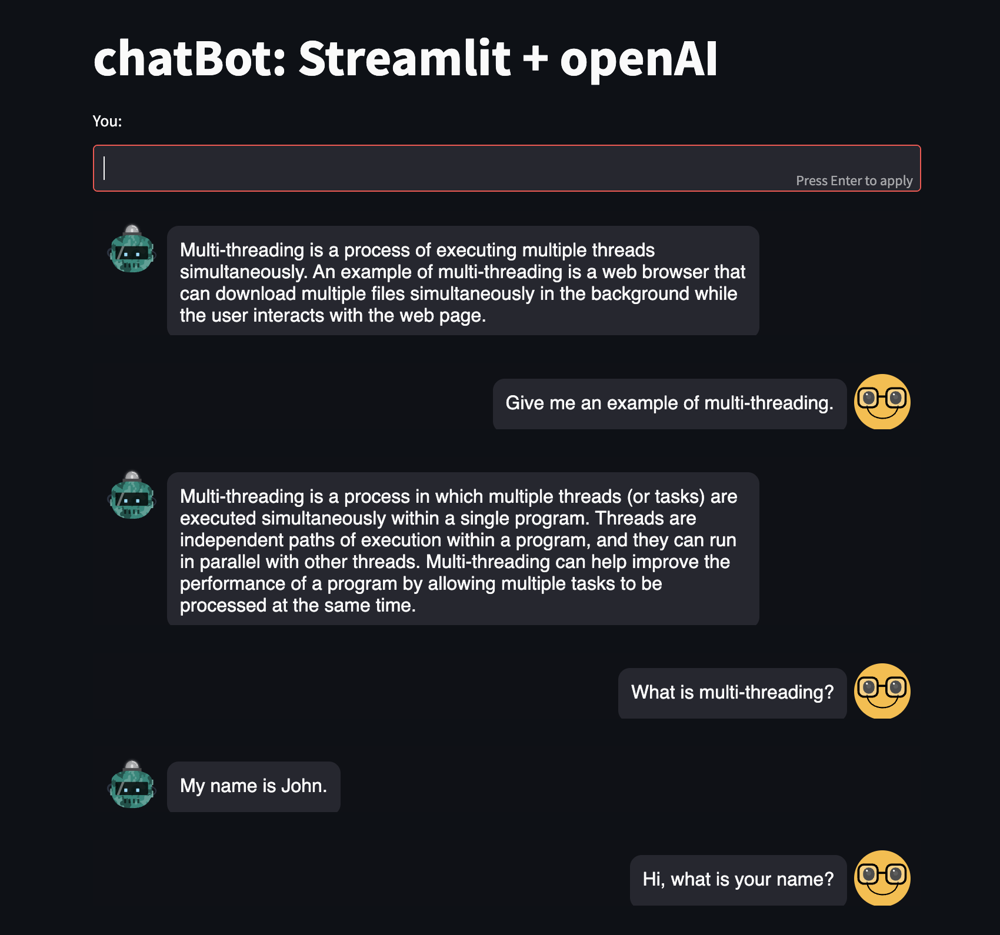

# Project goal
Practice building applications with OpenAI API, starting with a basic chatbot that can answer general knowledge questions.

# Tech stack
- Python
- Streamlit
- OpenAI APIs

This is my first time using Streamlit. It is an open-source app framework and a Python package that can help me create a web application without involving any front-end framework or coding in HTML, CSS and JavaScript. It serves my purpose well.

# MVP
- Get user input.
- Make requests to the Completion endpoint of OpenAI API to get responses to user input.
- Display the chat history on screen.

# Screenshot

  

# Future improvements:
- Check contents of user input (by calling the Moderations endpoint).
- Evaluate inputs by classification.
- Check outputs and evaluation.
- Train the bot with specific datasets.

# Resources for this project:
- <a href="https://platform.openai.com/docs/api-reference/introduction"> OpenAI documentation </a>
- <a href="https://www.deeplearning.ai/short-courses/building-systems-with-chatgpt/"> Building Systems with the ChatGPT API </a>
- <a href="https://medium.com/@avra42/build-your-own-chatbot-with-openai-gpt-3-and-streamlit-6f1330876846"> Medium article </a>